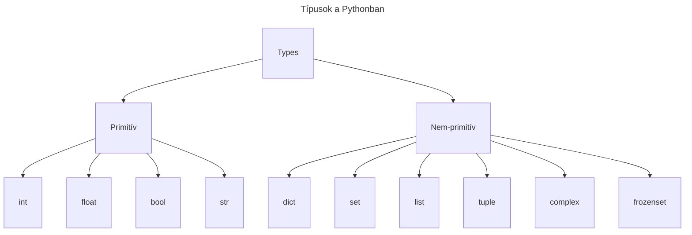

### Általános típusok

Az alábbi ábrán láthatóak a Python összes típusa.

Néhány, amit látunk, nem lesz megemlítve, mert a tesztben nem használjuk őket.



## int (Egész szám) [#int]
    Az egész számok a törtrész nélküli számokat képviselik. Lehetnek pozitívak, negatívak vagy nulla.

    ```py filename="example.py" /int/2,4
        x = 10  # Alapértelmezés szerint az egész számok egész számok
        x = int(9.61) # Egy lebegőpontos számot átalakíthatsz egész számmá
        x: int  # Tipusdefiníció az egész számra
    ```
### Gyakran használt metódusok

#### abs()
```py filename="example.py" /abs/
    x = abs(-7.25)  #  x: 7.25
    
```

## float (Lebegőpontos szám) [#float]
    A lebegőpontos számok a valós számokat képviselik tizedes ponttal.

    Az egész számokkal ellentétben a lebegőpontos számok korlátozott pontossággal rendelkeznek, a számítógépes memóriában való ábrázolás módja miatt.

    ```py filename="example.py" /float/2,4
    x = 3.14159  # A tizedesponttal rendelkező számok alapértelmezés szerint lebegőpontos számok
    x = 3.14e6  # Tudományos jelölést is használhatsz
    x = float(4)  # Egy egész számot átalakíthatsz lebegőpontos számmá
    x: float  # Tipusdefiníció a lebegőpontos számra
    ```

### Gyakran használt metódusok

#### round()
Egy számot egy megadott tizedesjegyig kerekít.
```py filename="example.py" /round/1-2 /ceil/1 /floor/1
    x = round(3.14159265)   #  x: 3
    x = round(3.14159265, 2) #  x: 3.14
    # Ha manipulálni szeretnéd, hogy melyik irányba kerekítsen, használd
    import math
    x = math.ceil(3.14159265) # x: 4   a math.ceil mindig felfelé kerekít
    x = math.floor(6.9) # x : 6        a math.floor mindig lefelé kerekít
```

## str (String)

    A stringek karakterek sorozata. Egyes idézőjelekkel `'` vagy dupla idézőjelekkel `"` határozhatók meg.

    ```py filename="example.py" /upper/ /lower/ /title/ /x+y/ /str/
        x = "Cukikák on top"
        # A nagybetűk manipulálása
        x = x.upper()  # x: "CUKIKÁK ON TOP"
        x = x.lower()  # x: "cukikák on top"
        x = x.title()  # x: "Cukikák On Top"

        x: str  # Tipusdefiníció a stringre

        # Két stringet összeadhatsz
        y = " forever"
        z = x + y  # z: "Cukikák on top forever"
    ```

### Gyakran használt metódusok
#### len()
Visszatér a string karaktereinek számával (beleértve a szóközöket is).

```py filename="example.py" /len/
    x = "Cukikák"
    print(len(x))  # Kimenet: 7
```

#### split()
Egy stringet listára bont egy megadott elválasztó alapján. Ha nincs megadva elválasztó, akkor a string szóközöknél lesz bontva.

```py filename="example.py" /split/
    x = "Cukikák, on, top."
    y = x.split()  # y: ['Cukikák,', 'on,', 'top.']
    z = x.split(",")  # z: ['Cukikák', ' on', ' top.']
```

#### replace()
Egy alstringet egy másik alstringre cserél.

Két argumentumot vesz fel: az alstringet, amit cserélni kell, és az alstringet, amire cserélni kell.

```py copy filename="example.py" /replace/
    x = "Cukikák 4ever"
    y = x.replace("4", "for")  # y: "Cukikák forever"
```

További információkért a string metódusokról, lásd [Class - Fájlok olvasása](/docs/hu/py/class/read-files).

### F-stringek [#f-string]

Az F-stringek lehetővé teszik kifejezések beágyazását a string literálokba, {} használatával.

```py filename="example.py" /f-string/
    name = "Alice"
    age = 25
    print(f"A nevem {name} és {age} éves vagyok.")  # Kimenet: A nevem Alice és 25 éves vagyok.
```

Számok formázására is használhatod az f-stringeket.

```py filename="example.py" /f-string/
    x = 3.14159
    print(f"Pi körülbelül {x:.2f}")  # Kimenet: Pi körülbelül 3.14
    y = 1000000000
    # Használhatsz vesszőket az ezresek elválasztására
    print(f"{y:,}")  # Kimenet: 1,000,000,000

    # Használhatod az _ jelet is a számok elválasztására
    print(f"{y:_}")  # Kimenet: 1_000_000_000

    # Használhatod a tudományos jelölést is
    print(f"{y:.2e}")  # Kimenet: 1.00e+09

    # Használhatod a +, - jeleket vagy egy szóközt a szám előjelének megjelenítésére
    print(f"{y:+}")  # Kimenet: +1000000000

    # A szám százalékos formázására is használhatod
    print(f"{0.25:.2%}")  # Kimenet: 25.00%
```

## bool (Boolean) [#bool]
A Pythonban a boolean értékek a két igazságértéket képviselik: `True` és `False`.

```py
    x = True  # Egy boolean érték
    x: bool  # Tipusdefiníció a booleanra
```

Más típusok boolean értékekre konvertálódnak, ha kifejezésben használják őket.

```py /not/ filename="example.py"
    # egy számnál (float, int, complex) 0 jelenti a False-t és minden más érték True
    0 == False # True,   0 False
    1 == False  # False, 1 nem False
    
    # Egy string False lesz, ha üres, különben True lesz
    "" == False # True,             "" False
    "Cukikák" == False  # False,    "" nem False

    # Egy lista False lesz, ha üres, különben True lesz (ugyanez igaz a set, tuple, dict, frozenset esetén)
    [] == False # True,             [] False
    [1, 2, 3] == False  # False,    [1, 2, 3] nem False
```

## list (Lista) [#list]

A Pythonban a `list` egy beépített adattípus, amely elemek gyűjteményének tárolására szolgál. A listák rendezettek, módosíthatók (változtathatók), és lehetnek bennük duplikált elemek. Különböző típusú elemeket tárolhatnak, de leggyakrabban ugyanazon típusú elemeket tartalmaznak.

### Használat

List

ák létrehozása:

```py filename="example.py" /list/ /len/
x = [1, 2, 3, 4, 5]
y = ["apple", "banana", "cherry"]
z = [1, "apple", 3.14, True]

# Üres lista létrehozása
empty_list = []

# Lista hossza
length = len(x)  # Kimenet: 5
```

### Hozzáférés a lista elemeihez

Listák indexelése nulla-alapú, vagyis az első elem indexe 0.

```py filename="example.py" /list/
x = [1, 2, 3, 4, 5]

# Első elem
first_element = x[0]  # Kimenet: 1

# Utolsó elem
last_element = x[-1]  # Kimenet: 5

# Második és negyedik elem közötti részlista (szeletelés)
sub_list = x[1:3]  # Kimenet: [2, 3]
```

### Lista módosítása

A listák módosíthatók, ami azt jelenti, hogy elemeket hozzáadhatsz, eltávolíthatsz vagy módosíthatsz.

```py filename="example.py" /list/
x = [1, 2, 3, 4, 5]

# Módosítás
x[0] = 10  # x: [10, 2, 3, 4, 5]

# Elem hozzáadása
x.append(6)  # x: [10, 2, 3, 4, 5, 6]

# Elem eltávolítása
x.remove(3)  # x: [10, 2, 4, 5, 6]
```

### Gyakran használt metódusok

#### append()
Elem hozzáadása a lista végéhez.

```py filename="example.py" /append/
x = [1, 2, 3]
x.append(4)  # x: [1, 2, 3, 4]
```

#### insert()
Elem hozzáadása egy megadott pozícióhoz a listában.

```py filename="example.py" /insert/
x = [1, 2, 4]
x.insert(2, 3)  # x: [1, 2, 3, 4]
```

#### remove()
Az első előfordulás eltávolítása a listából.

```py filename="example.py" /remove/
x = [1, 2, 3, 2]
x.remove(2)  # x: [1, 3, 2]
```

#### pop()
Az utolsó elem eltávolítása és visszatérése.

```py filename="example.py" /pop/
x = [1, 2, 3]
y = x.pop()  # y: 3, x: [1, 2]
```

#### sort()
Lista elemeinek rendezése.

```py filename="example.py" /sort/
x = [3, 1, 2]
x.sort()  # x: [1, 2, 3]
```

#### reverse()
Lista elemeinek megfordítása.

```py filename="example.py" /reverse/
x = [1, 2, 3]
x.reverse()  # x: [3, 2, 1]
```

## dict (Szótár) [#dict]

A Pythonban a `dict` egy beépített adattípus, amely kulcs-érték párok tárolására szolgál. A szótárak rendezettek (Python 3.7-től kezdve), módosíthatók és nem tartalmazhatnak duplikált kulcsokat.

### Használat

Szótárak létrehozása:

```py filename="example.py" /dict/
x = {"name": "Alice", "age": 25, "city": "New York"}

# Üres szótár létrehozása
empty_dict = {}

# Szótár hossza
length = len(x)  # Kimenet: 3
```

### Hozzáférés a szótár elemeihez

Kulcsok használata az értékek eléréséhez:

```py filename="example.py" /dict/
x = {"name": "Alice", "age": 25, "city": "New York"}

# Érték elérése kulcs alapján
name = x["name"]  # Kimenet: "Alice"

# Érték módosítása kulcs alapján
x["age"] = 30  # x: {"name": "Alice", "age": 30, "city": "New York"}
```

### Gyakran használt metódusok

#### keys()
Visszatér a szótár összes kulcsával.

```py filename="example.py" /keys/
x = {"name": "Alice", "age": 25, "city": "New York"}
keys = x.keys()  # keys: dict_keys(['name', 'age', 'city'])
```

#### values()
Visszatér a szótár összes értékével.

```py filename="example.py" /values/
x = {"name": "Alice", "age": 25, "city": "New York"}
values = x.values()  # values: dict_values(['Alice', 25, 'New York'])
```

#### items()
Visszatér a szótár összes kulcs-érték párjával.

```py filename="example.py" /items/
x = {"name": "Alice", "age": 25, "city": "New York"}
items = x.items()  # items: dict_items([('name', 'Alice'), ('age', 25), ('city', 'New York')])
```

#### get()
Visszatér egy értékkel egy adott kulcs alapján. Ha a kulcs nem létezik, akkor egy megadott alapértelmezett értékkel tér vissza.

```py filename="example.py" /get/
x = {"name": "Alice", "age": 25, "city": "New York"}
name = x.get("name")  # Kimenet: "Alice"
country = x.get("country", "USA")  # Kimenet: "USA"
```

#### update()
Egy másik szótár elemeivel bővíti a szótárat.

```py filename="example.py" /update/
x = {"name": "Alice", "age": 25}
y = {"city": "New York", "age": 30}
x.update(y)  # x: {"name": "Alice", "age": 30, "city": "New York"}
```

#### pop()
Eltávolít egy kulcs-érték párt és visszatér az értékkel.

```py filename="example.py" /pop/
x = {"name": "Alice", "age": 25, "city": "New York"}
age = x.pop("age")  # age: 25, x: {"name": "Alice", "city": "New York"}
```

## tuple (Tupel) [#tuple]

A Pythonban a `tuple` egy beépített adattípus, amely elemek gyűjteményének tárolására szolgál. A tuple-k rendezettek és változtathatatlanok (immutable), azaz az elemeik nem módosíthatók a létrehozásuk után. Lehetnek bennük duplikált elemek és különböző típusú elemeket is tárolhatnak.

### Használat

Tuple-k létrehozása:

```py filename="example.py" /tuple/
x = (1, 2, 3)
y = ("apple", "banana", "cherry")
z = (1, "apple", 3.14, True)

# Üres tuple létrehozása
empty_tuple = ()
```

### Hozzáférés a tuple elemeihez

Tuple-k indexelése nulla-alapú, azaz az első elem indexe 0.

```py filename="example.py" /tuple/
x = (1, 2, 3, 4, 5)

# Első elem
first_element = x[0]  # Kimenet: 1

# Utolsó elem
last_element = x[-1]  # Kimenet: 5

# Második és negyedik elem közötti részlista (szeletelés)
sub_tuple = x[1:3]  # Kimenet: (2, 3)
```

### Tuple módosítása

Mivel a tuple-k változtathatatlanok, nem lehet közvetlenül módosítani őket. Azonban létrehozhatsz egy új tuple-t a meglévő elemek módosításával vagy bővítésével.

```py filename="example.py" /tuple/
x = (1, 2, 3)

# Új tuple létrehozása elemek hozzáadásával
y = x + (4, 5)  # y: (1, 2, 3, 4, 5)
```

### Gyakran használt met

ódusok

#### count()
Visszatér az adott elem előfordulásainak számával a tuple-ben.

```py filename="example.py" /count/
x = (1, 2, 2, 3, 4, 2)
count_2 = x.count(2)  # Kimenet: 3
```

#### index()
Visszatér az adott elem első előfordulásának indexével a tuple-ben.

```py filename="example.py" /index/
x = (1, 2, 3, 4, 5)
index_3 = x.index(3)  # Kimenet: 2
```

## set (Halmaz) [#set]

A Pythonban a `set` egy beépített adattípus, amely egyedi elemek gyűjteményének tárolására szolgál. A halmazok rendezetlenek és nem tartalmaznak duplikált elemeket. A halmazok elemei változtathatók, azonban maga a halmaz változtathatatlan (immutable), azaz a halmaz elemeit nem lehet módosítani, miután hozzáadjuk őket a halmazhoz.

### Használat

Halmazok létrehozása:

```py filename="example.py" /set/
x = {1, 2, 3, 4, 5}
y = {"apple", "banana", "cherry"}
z = {1, "apple", 3.14, True}

# Üres halmaz létrehozása
empty_set = set()
```

### Hozzáférés a halmaz elemeihez

Mivel a halmazok rendezetlenek, nem lehet közvetlenül indexelni őket. Azonban iterálhatsz a halmaz elemein egy for ciklussal.

```py filename="example.py" /set/
x = {1, 2, 3, 4, 5}

for elem in x:
    print(elem)
```

### Halmaz módosítása

A halmazok módosíthatók, azaz elemeket hozzáadhatsz vagy eltávolíthatsz.

```py filename="example.py" /set/
x = {1, 2, 3}

# Elem hozzáadása
x.add(4)  # x: {1, 2, 3, 4}

# Elem eltávolítása
x.remove(2)  # x: {1, 3, 4}
```

### Gyakran használt metódusok

#### add()
Elem hozzáadása a halmazhoz.

```py filename="example.py" /add/
x = {1, 2, 3}
x.add(4)  # x: {1, 2, 3, 4}
```

#### remove()
Elem eltávolítása a halmazból.

```py filename="example.py" /remove/
x = {1, 2, 3}
x.remove(2)  # x: {1, 3}
```

#### union()
Két halmaz egyesítése.

```py filename="example.py" /union/
x = {1, 2, 3}
y = {3, 4, 5}
z = x.union(y)  # z: {1, 2, 3, 4, 5}
```

#### intersection()
Két halmaz metszetének létrehozása.

```py filename="example.py" /intersection/
x = {1, 2, 3}
y = {2, 3, 4}
z = x.intersection(y)  # z: {2, 3}
```

#### difference()
Két halmaz különbségének létrehozása.

```py filename="example.py" /difference/
x = {1, 2, 3}
y = {2, 3, 4}
z = x.difference(y)  # z: {1}
```

## frozenset (frozenset) [#frozenset]

A `frozenset` a Pythonban egy beépített adattípus, amely egy változtathatatlan (immutable) halmaz. A `frozenset` elemei nem módosíthatók a létrehozásuk után.

### Használat

frozensetek létrehozása:

```py filename="example.py" /frozenset/
x = frozenset([1, 2, 3, 4, 5])
y = frozenset(["apple", "banana", "cherry"])
z = frozenset([1, "apple", 3.14, True])

# Üres frozenset létrehozása
empty_frozenset = frozenset()
```

### Hozzáférés a frozenset elemeihez

A frozensetek elemeihez való hozzáférés hasonló a halmazokhoz, mivel azok rendezetlenek és nem indexelhetők közvetlenül.

```py filename="example.py" /frozenset/
x = frozenset([1, 2, 3, 4, 5])

for elem in x:
    print(elem)
```

### frozenset metódusai

A frozensetek rendelkeznek a halmazok összes metódusával, kivéve a módosítási metódusokat (`add()`, `remove()`, stb.), mivel a frozensetek változtathatatlanok.

#### union()
Két frozenset egyesítése.

```py filename="example.py" /union/
x = frozenset([1, 2, 3])
y = frozenset([3, 4, 5])
z = x.union(y)  # z: frozenset([1, 2, 3, 4, 5])
```

#### intersection()
Két frozenset metszetének létrehozása.

```py filename="example.py" /intersection/
x = frozenset([1, 2, 3])
y = frozenset([2, 3, 4])
z = x.intersection(y)  # z: frozenset([2, 3])
```

#### difference()
Két frozenset különbségének létrehozása.

```py filename="example.py" /difference/
x = frozenset([1, 2, 3])
y = frozenset([2, 3, 4])
z = x.difference(y)  # z: frozenset([1])
```
